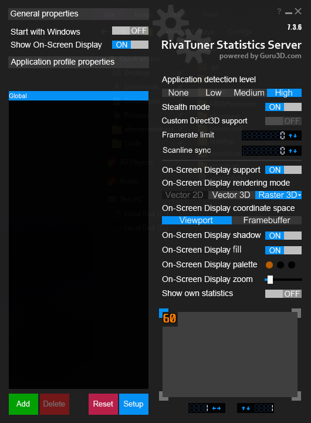
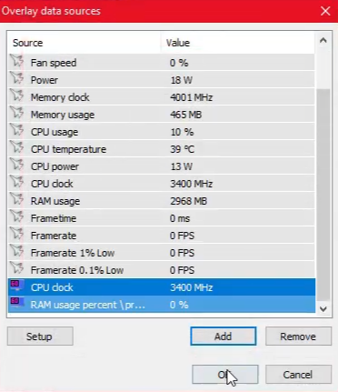

1. Create symlinks
   ```powershell
   New-Item -ItemType SymbolicLink -Path "C:\Program Files (x86)\RivaTuner Statistics Server\Profiles\" -Target "C:\Users\<USER_NAME>\Configs\MSIAfterBurner\RivaTuner Statistics Server\Profiles\"
   ```
   
   ```powershell
   New-Item -ItemType SymbolicLink -Path "C:\Program Files (x86)\RivaTuner Statistics Server\Plugins\" -Target "C:\Users\<USER_NAME>\Configs\MSIAfterBurner\RivaTuner Statistics Server\Plugins\"
   ```
2. Apply config
   
3. Setup > Plugins > Overlay Editor
4. Layouts > Edit > EmbededImage > Custom Overlay.png
5. Data Sources > Edit > Add
    
6. Layouts > Load > ahmetcetinkaya.ovl