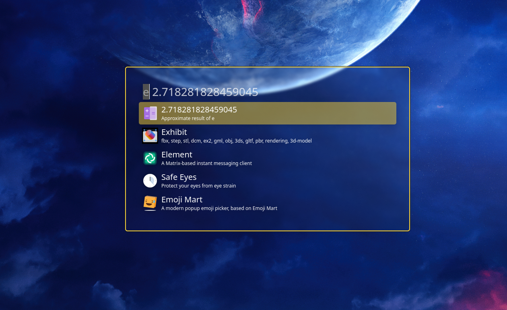

# 🌟 Albert Custom Config

This guide helps you set up the [**Albert**](https://github.com/albertlauncher/albert) transparent theme.



## ⚙️ Setup

1. **Copy the Theme File**:
   Run the following command to copy the custom `ahmetcetinkaya.qss` theme file to the appropriate directory:

   ```sh
   sudo cp ./ahmetcetinkaya.qss /usr/share/albert/widgetsboxmodel/themes/
   ```

   - This command copies the theme file to the **Albert** themes folder, making it available for use.

2. **Apply the Theme**:
   After copying the theme, you may need to restart **Albert** or reload the theme settings within **Hyperland** for the changes to take effect.
