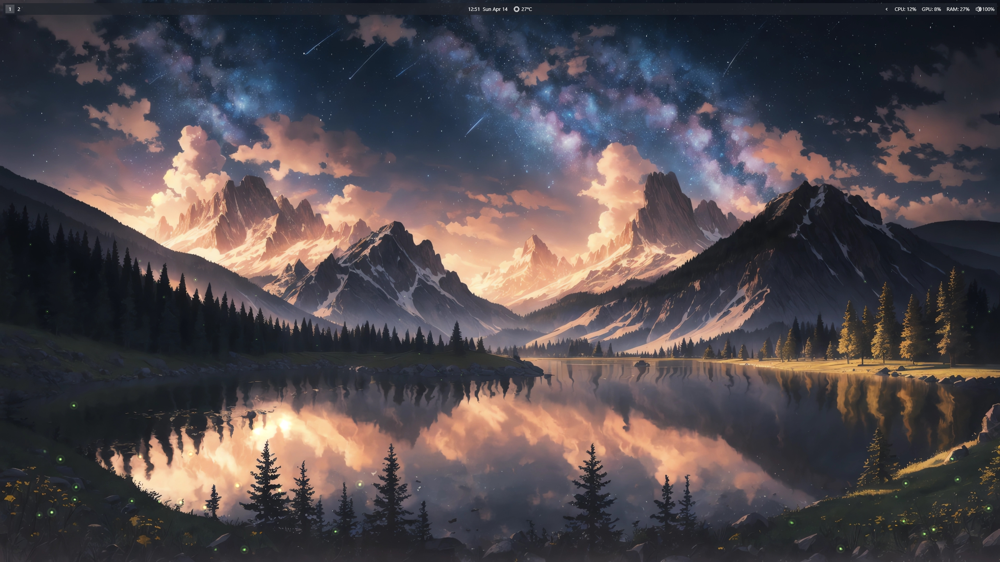
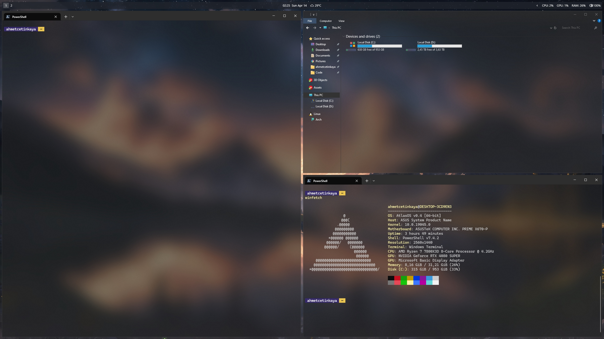

# Customizations

- [AtlasOS](https://github.com/Atlas-OS/Atlas): OS
- [GlazeVM](https://github.com/glzr-io/glazewm) - [Config](https://github.com/ahmet-cetinkaya/dotfiles-public/blob/main/glaze-vm/) :  Tile Managment
- [Windows Terminal](https://github.com/microsoft/terminal) - [Config](https://github.com/ahmet-cetinkaya/dotfiles-public/blob/main/windows-terminal/)
- [Powershell](https://github.com/PowerShell/PowerShell) - [Config](https://github.com/ahmet-cetinkaya/dotfiles-public/blob/main/powershell/)
- [Powertoys](https://github.com/microsoft/PowerToys): Search & Launcher
- [ExplorerBlurMica](https://github.com/Maplespe/ExplorerBlurMica)
- [Lumicons](https://www.deviantart.com/niivu/art/Lumicons-Installer-812994066) : Icon Pack
- Nircmd: Hide Taskbar (`nircmd win trans class Shell_TrayWnd 256`)
- OldNewExplorer: Explorer configuration (`Hide caption text in File Explorer windows`, `Hide caption icon in File Explorer windows`, `Hide Up (go to parent folder) button`)

# General Tools
- [Terminal Tools](https://github.com/ahmet-cetinkaya/dotfiles-public/blob/main/powershell/README.md)
  - [Winfetch AtlasOS configration](https://github.com/ahmet-cetinkaya/dotfiles-public/blob/main/atlas-os/winfetch)
- [Powertoys](https://github.com/microsoft/PowerToys)
- [simplewall](https://github.com/henrypp/simplewall)
- [Traymond](https://github.com/fcFn/traymond)
- [SoundSwitch](https://github.com/Belphemur/SoundSwitch)
- [XDM](https://github.com/subhra74/xdm)