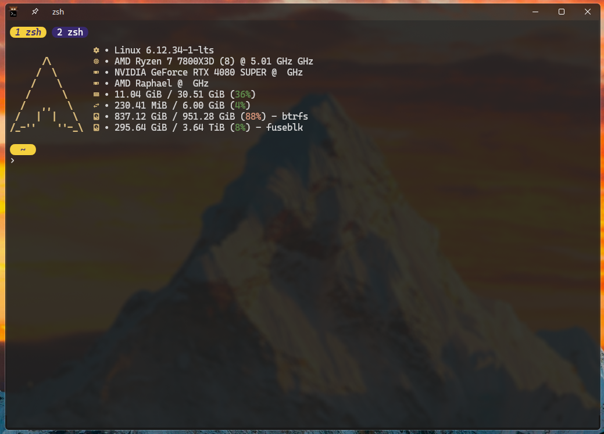

# 🖥️ Kitty Terminal Custom Config Setup

This guide helps you set up symbolic links to use custom [**Kitty Terminal**](https://github.com/kovidgoyal/kitty) configuration files and folders on **Linux**.



## ⚙️ Setup

### 🐧 Linux Setup

1. **Open a terminal**.
2. **Create Symbolic Link for Kitty Config Folder**:
   Run the following command to link your custom **Kitty Terminal** configuration folder to its default location:
   ```bash
   ln -s ~/Configs/kitty ~/.config/kitty
   ```
   - Replace `~/Configs/kitty` with the path to your custom **Kitty Terminal** configuration folder.
   - This command creates a symbolic link for the entire **Kitty** config folder, so **Kitty Terminal** uses all your custom configurations (e.g., `kitty.conf`, themes, and any other files inside the folder).
