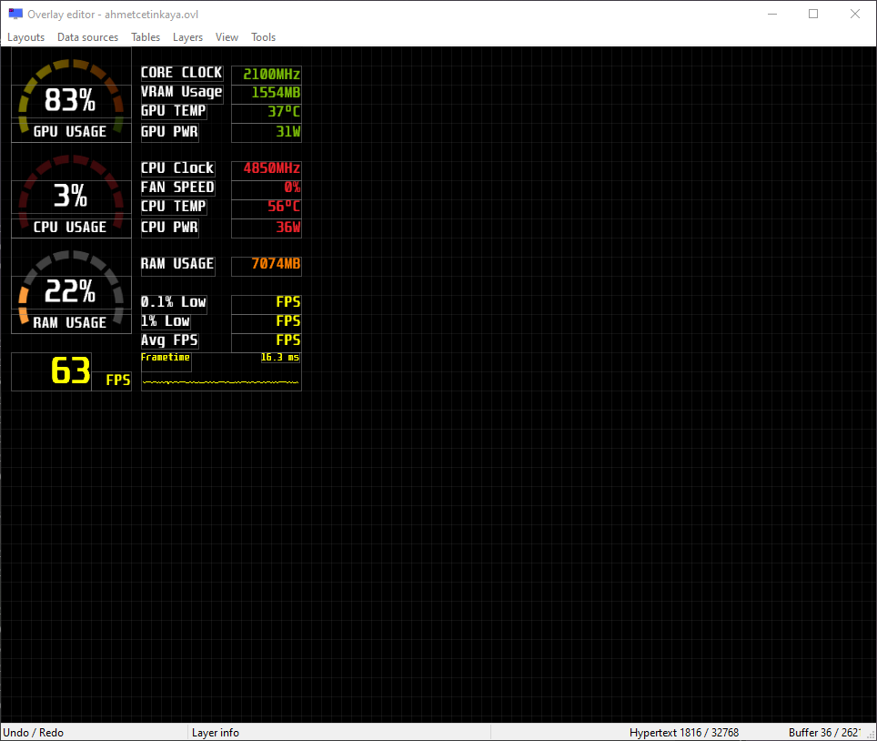

# 🖥️ MSI Afterburner On-screen Display RTSS Overlay

This guide will show you how to set up **MSI Afterburner** and **RivaTuner Statistics Server (RTSS)** for displaying on-screen statistics during your gaming or benchmarking sessions.



## ⚙️ Setup

1. **Link MSI Afterburner Profiles**:
   ```powershell
   New-Item -ItemType SymbolicLink -Path "C:\Program Files (x86)\MSI Afterburner\Profiles\" -Target "C:\Users\$env:USERNAME\Configs\msi-afterburner\MSI Afterburner\Profiles\"
   ```

2. **Link RivaTuner Statistics Server Profiles**:
   ```powershell
   New-Item -ItemType SymbolicLink -Path "C:\Program Files (x86)\RivaTuner Statistics Server\Profiles\" -Target "C:\Users\$env:USERNAME\Configs\msi-afterburner\RivaTuner Statistics Server\Profiles\"
   ```

3. **Link RivaTuner Statistics Server Plugins**:
   ```powershell
   New-Item -ItemType SymbolicLink -Path "C:\Program Files (x86)\RivaTuner Statistics Server\Plugins\" -Target "C:\Users\$env:USERNAME\Configs\msi-afterburner\RivaTuner Statistics Server\Plugins\"
   ```

### 2. **Apply Configuration in RTSS**

2.1 Open **RivaTuner Statistics Server (RTSS)**.

2.2 Apply your custom configuration. You can check the applied configuration by looking at this example screenshot:

   

### 3. **Set Up the Overlay**

3.1 Open **RTSS** and navigate to **Setup**.

3.2 Under **Plugins**, select **Overlay Editor**.

### 4. **Edit Layouts**

4.1 In the **Layouts** section, click **Edit**.

4.2 Select **EmbededImage** and set it to your custom overlay image (e.g., `Custom Overlay.png`).

### 5. **Add Data Sources**

5.1 In **RTSS**, go to **Data Sources** and click **Edit**.

5.2 Add the necessary data sources for the overlay, such as FPS, GPU usage, and temperature.

   Example screenshots for adding data sources:

     
   

### 6. **Load Your Layout**

6.1 In the **Layouts** section, click **Load**.

6.2 Select your custom layout file (e.g., `ahmetcetinkaya.ovl`) to load the overlay settings.
