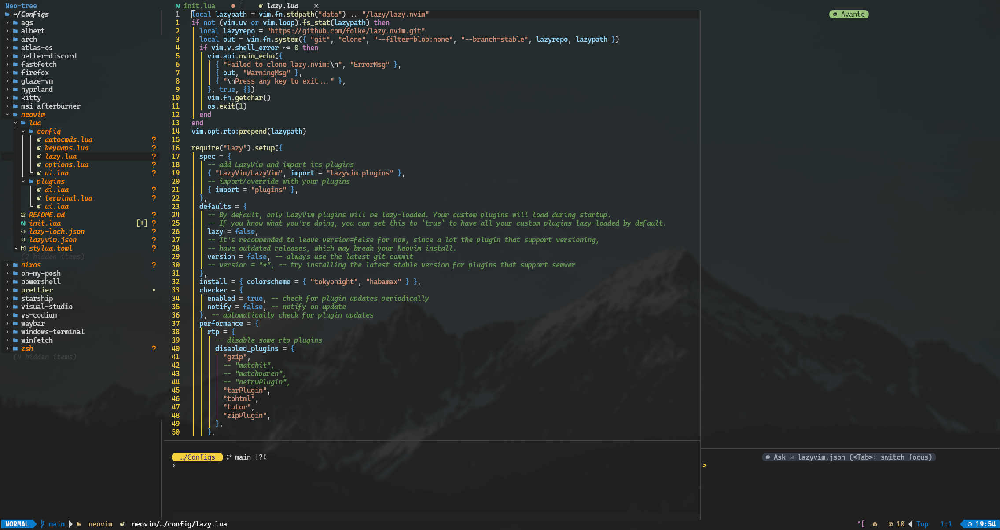

# 📝 Neovim Custom Config

Neovim is a highly extensible and customizable text editor. This guide will show you how to configure [**Neovim**](https://github.com/neovim/neovim) to use a custom configuration folder.



## 🌟 Features
- [lazy.vim](https://github.com/folke/lazy.nvim) for lazy loading of plugins
- [LazyVim](https://github.com/LazyVim/LazyVim) distribution.
- Custom key mappings
- Status line
- LSP configurations
- Completion engine configurations
- File explorer configurations
- Terminal configurations
- AI code completion and editor

## ⚙️ Setup

### 🐧 Linux

1. **Link Your Custom Neovim Configuration**:

   Assuming your custom Neovim configurations are stored in `~/Configs/neovim`, create a symbolic link to your custom configuration folder in the default Neovim config directory:

   ```bash
   ln -s ~/Configs/neovim ~/.config/nvim
   ```
   
   - Replace `~/Configs/neovim` with the path to your custom Neovim configuration folder.

### 🪟 Windows

1. **Link Your Custom Neovim Configuration**:

   Assuming your custom Neovim configurations are stored in `C:\Users\<YourUsername>\Configs\neovim`, create a symbolic link from your custom configuration folder to the default Neovim configuration folder:

   ```powershell
   New-Item -ItemType SymbolicLink -Path "C:\Users\<YourUsername>\AppData\Local\nvim" -Target "C:\Users\<YourUsername>\Configs\neovim"
   ```
   
   - Replace `<YourUsername>` with your actual Windows username.
   - Replace `C:\Users\<YourUsername>\Configs\neovim` with the path to your custom Neovim configuration folder.
