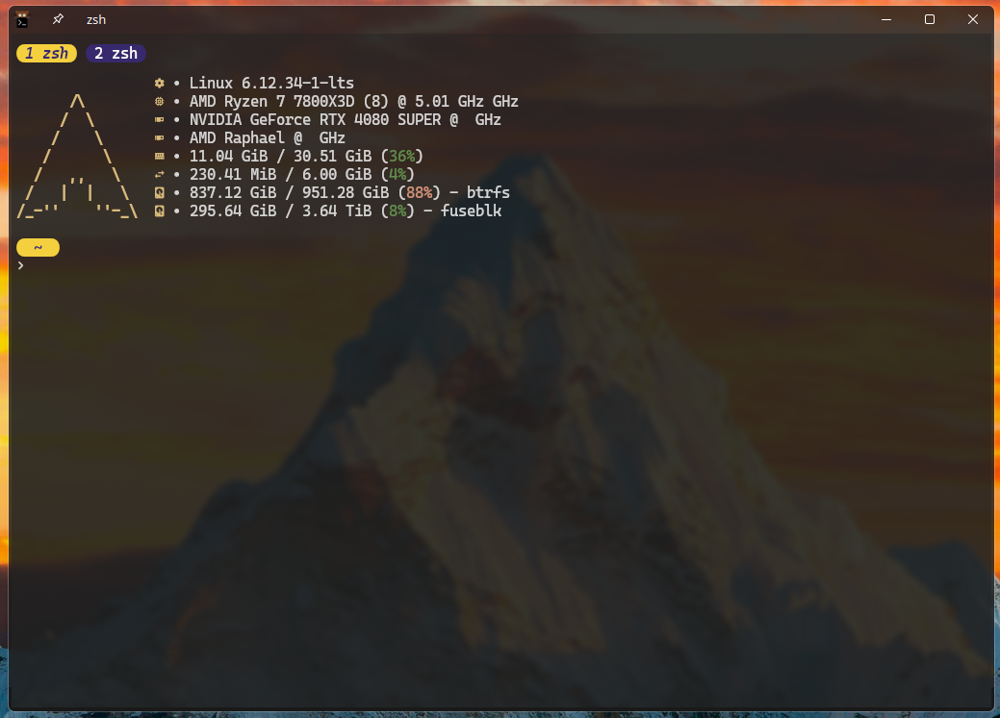

# 🐚 Zsh Custom Config Setup

This guide helps you set up symbolic links to use custom Zsh configuration files.



## ⚙️ Setup

1. **Open a terminal**.

2. **Create Symbolic Links**:
   Run the following commands to link your custom Zsh configuration file to their default locations:

   ```bash
   ln -s ~/Configs/zsh/.zshrc ~/.zshrc
   ```

   - Replace `~/Configs/zsh/` with the path to your custom configuration files.

3. **Verify the Setup**:
   Restart your terminal or source your `.zshrc` file:

   ```bash
   source ~/.zshrc
   ```